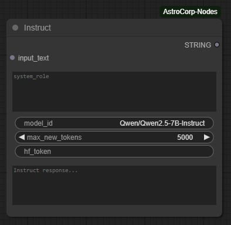
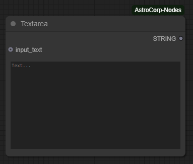
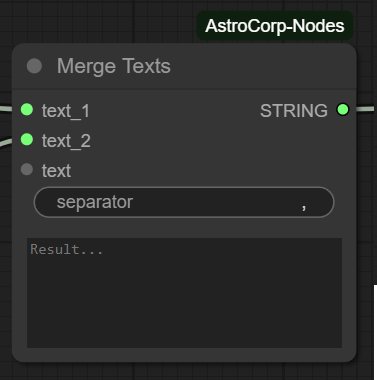

# ComfyUI AstroCorp Nodes

A collection of personal ComfyUI nodes designed to enhance and automate workflows.

- [Nodes](#nodes)
- [Installation](#installation)
- [Usage](#usage)

## Nodes
### Instruct

Processes the given text according to the instructions in the system prompt.



### Textarea

A text field that allows manual text input and also previews text from other nodes.



## Merge Texts

Combines different input texts into a single output text, with the option to specify a custom separator between them.



## Installation

1. Create a Hugging Face account if you don't have one
2. If required, request access to the model.
3. Generate an access token at: https://huggingface.co/settings/tokens
4. Add this repository to your ComfyUI custom nodes directory:
```bash
cd ComfyUI/custom_nodes
git clone https://github.com/your-username/comfyui_astro_nodes.git
```

> [!NOTE]  
> ComfyUI AstroCorp Nodes now available in ComfyUI Manager.

## Usage

After installation, restart ComfyUI to load the new nodes. The nodes will appear in the node menu under the "AstroCorp" category.
