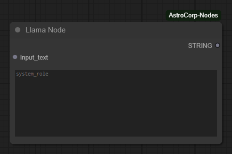

# ComfyUI AstroCorp Nodes

- Llama Node: Processes the given text according to the instructions in the system prompt.



## Installation

1. Make sure you have a Hugging Face account
2. Request access to the model at: https://huggingface.co/meta-llama/Llama-3.2-1B-Instruct
3. Login to Hugging Face CLI to get your token:
```bash
huggingface-cli login
```
4. Add this repository to your ComfyUI custom nodes directory:
```bash
cd ComfyUI/custom_nodes
git clone https://github.com/your-username/comfyui_astro_nodes.git
```

## Usage

After installation, restart ComfyUI to load the new nodes. The nodes will appear in the node menu under the "AstroCorp" category.
