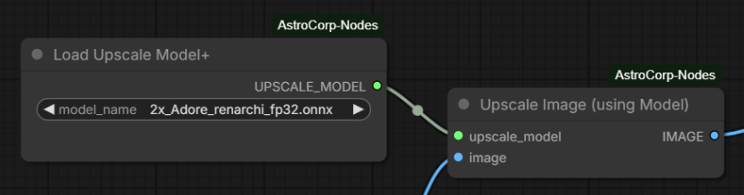
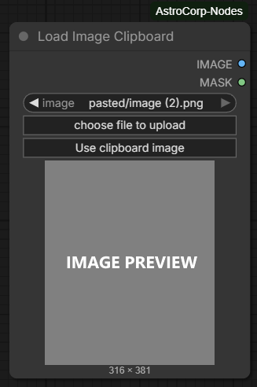
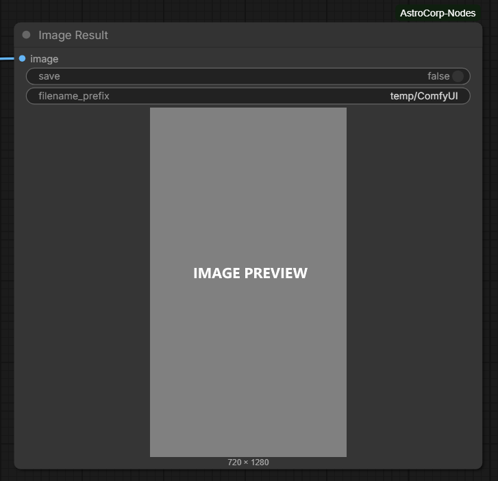
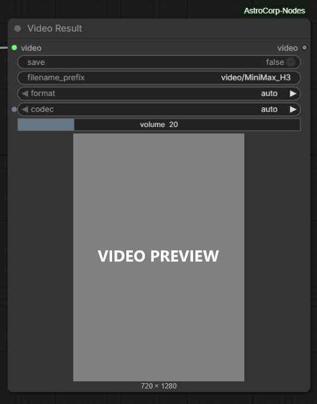
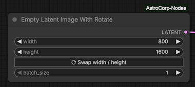
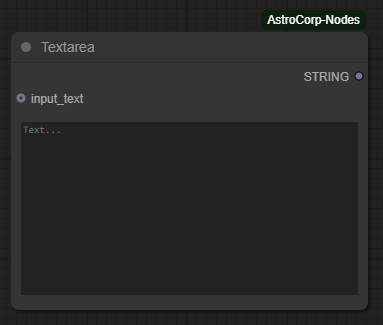
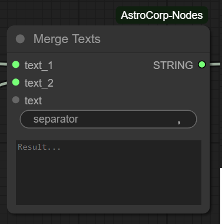

# ComfyUI AstroCorp Nodes

A collection of personal ComfyUI nodes designed to enhance and automate workflows.

- [Nodes](#nodes)
- [Installation](#installation)
- [Usage](#usage)

## Nodes

### Load Upscale Model+ / Upscale Image (using Model)

Same as ComfyUI’s upscaler, using files from `models/upscale_models`, plus support for ONNX models. The first ONNX run compiles a TensorRT engine under `models/tensorrt/upscaler`.



### Load Image Clipboard

Loads an image like ComfyUI’s Load Image node, with an extra button to use the clipboard image.



### Image Result

Combining the "Preview Image" and "Save Image" nodes of comfyUI.



### Video Result

Same as ComfyUI’s Save Video, plus a toggle to preview without saving.



### Empty Latent Image With Rotate

Same as ComfyUI’s Empty Latent Image, plus a button to swap width and height.



### Textarea

A text field that allows manual text input and also previews text from other nodes.



## Merge Texts

Merge different input texts into a single output text, with the option to specify a custom separator between them.



## Installation

Add this repository to your ComfyUI custom nodes directory:
```bash
cd ComfyUI/custom_nodes
git clone https://github.com/your-username/comfyui_astro_nodes.git
```

ONNX upscaling uses TensorRT when it is installed in the ComfyUI Python environment. If TensorRT is missing, install `onnxruntime-gpu` (or `onnxruntime`) as a fallback.

> [!NOTE]  
> ComfyUI AstroCorp Nodes now available in ComfyUI Manager.

## Usage

After installation, restart ComfyUI to load the new nodes. The nodes will appear in the node menu under the "AstroCorp" category.
